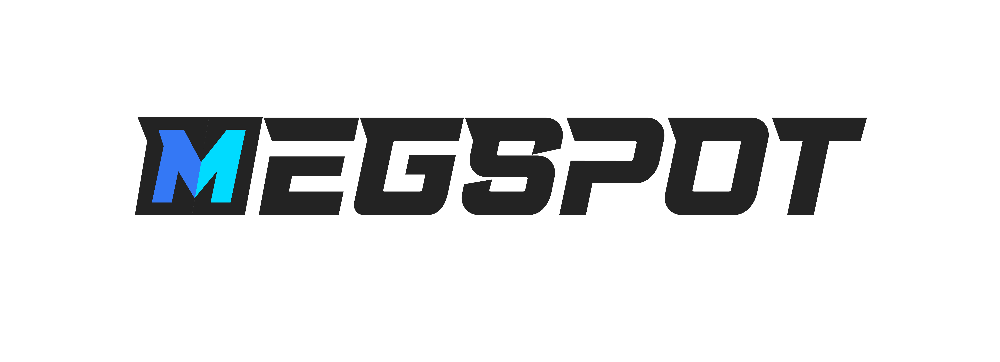

# MegSpot

<p align="center">
  
</p>

English | [中文](README.md)

**MegSpot** is an efficient, professional, cross-platform image & video comparison application.

## Feature

- Support superimposed comparison, drag-and-drop comparison, and GIF result presentation.
- Support pixel-level image viewing, image histogram, RGB color information, coordinate information viewing.
- Support to adjust the brightness, contrast, saturation, grayscale and other indicators in time for preview, and support gamma and color scale adjustment.
- Support video comparison, and inherit all image comparison functions.
- Mac, Linux, Window cross-platform support & automatic update support.
- **HEVC/H.265 video hard decoding support**.
- Support the comparison of any screen of multiple videos.
- Support terminal command.
- Support multiple languages: Chinese, English, Japanese.

---

## Select

Selecting is a very distinctive and useful operating feature in **MegSpot**. It allows certain operations such as flipping, zooming, etc. to take effect only in one or two specified images.

**Usage scenarios**: **[Image Comparison](#image-comparison)**, **[Picture Comparison in Video Comparison](#video-comparison)**

[View the manual](https://github.com/MegEngine/MegSpot/wiki/选中)

---

## Image Comparison

**Image Comparison** is the core function of **MegSpot**. It can not only modify the original image according to the conditions you want (**specify brightness, blur, transparency**, etc.), but also can **flip, zoom, drag, and mirror** the image to assist. View, there are also **RGB color picker**, **zoom ratio setting bar** these convenient tools to help you get a better picture viewing experience

[View the manual](https://github.com/MegEngine/MegSpot/wiki/选中)

---

## Drag and Drop Comparison

From the pictures selected by the user, split the two pictures selected in the comparison file gallery (the first two pictures in the default list)

[View the manual](https://github.com/MegEngine/MegSpot/wiki/选中)

---

## Image Viewer

Enter through the **File Selection** page. Complete image viewing functions based on **OpenCV**, including: **zoom, drag and drop, histogram, RGBA value acquisition**, etc.

[View the manual](https://github.com/MegEngine/MegSpot/wiki/图片查看器)

---

## Video Comparison

The difference between **Video Comparison** and **Image Comparison** is that there is an additional **Video Preview** page for **Video Comparison**. You need to confirm the screenshot of each video you want to compare on the video preview page, and then click "**Image Comparison**" to enter the **video screenshot comparison mode**.

[View the manual](https://github.com/MegEngine/MegSpot/wiki/视频对比)

---

## File Select

**MegSpot** will store two **file path lists** locally, so that the last file list will be retained next time you open the application.
Similarly, **MegSpot** will also store two **folder path lists** locally.

[View the manual](https://github.com/MegEngine/MegSpot/wiki/文件选择)

#### File List

After clicking "**Image Comparison**" or "**Video Comparison**" from the homepage, you will first enter the respective "**File Selection**" page, which mainly contains the **Folder List** on the left and the **File List** on the right

[View the manual](https://github.com/MegEngine/MegSpot/wiki/文件列表)

### File Gallery

Centrally display all the files that the user has selected, and support dragging to adjust the order. Click the button "**Selected**" to open the "**File Gallery**".

[View the manual](https://github.com/MegEngine/MegSpot/wiki/文件长廊)

---

## Command Line Operation

In the **Linux** environment, operations such as **startup and comparison** are supported through the command line.

#### Support incoming folder or file address, support relative and absolute path

- `-h / --help`: view help
- `-i /--image`: enter image compare (default compare)
- `-v/ --video`: enter video compare
- `-c/ --clear`: Whether clear the selected files or not (default not to clear)

#### Example

- `MegSpot` enter main page
- `MegSpot -i` enter image compare
- `MegSpot -v` enter video compare
- `MegSpot path`Enter the image compare and selection file page (use the current path)
- `MegSpot path -v` Enter the image compare and selection file page (use the current path)
- `MegSpot filePath1 filePath2 filePath3 ...`Add picture/video comparison -v Compare video -c Clear the selected files before -v -c or -vc -cv

[View the manual](https://github.com/MegEngine/MegSpot/wiki/命令行操作)

---

## i18n

**MegSpot** supports multiple languages by default, and currently supports **Chinese, English, and Japanese** in the app. [Contributions](#contribution) to other language translations are welcome.

[View the manual](https://github.com/MegEngine/MegSpot/wiki/语言支持)

---

## Help Videos

The homepage has a carousel of help videos that are played in a scrolling loop. These help videos briefly introduce the usage and main points of each function.

[View the manual](https://github.com/MegEngine/MegSpot/wiki/帮助视频)

---

## Auto Update

In order to save users the trouble of manually downloading each time, **MegSpot** supports the automatic update function for **Windows**, **Linux** and **Mac** systems.

[View the manual](https://github.com/MegEngine/MegSpot/wiki/自动更新)

---

## Download&&install

1. Use the automatic update function of the installed **MegSpot** app.

2. Download

Download the installation package of the corresponding system in Github Releases and install it.

3. Compile and install through source code

   ```bash
   # install dependencies
   npm install or yarn install

   # start
   npm run dev

   # build all platform product
   npm run build:all

   # build contain platform product

   npm run build:mac

   npm run build:win64

   npm run build:win32

   ```

[View the manual](https://github.com/MegEngine/MegSpot/wiki/下载安装)

---

## contribution

- MegSpot according [Contributor Covenant](https://contributor-covenant.org)to manage the open source community。Please read [CODE_OF_CONDUCT](CODE_OF_CONDUCT.md) for details。
- Every contributor needs to sign a contributor license agreement（Contributor License Agreement，CLA）to clarify the intellectual property license related to the content of the contribution,for details[CONTRIBUTOR_LICENSE_AGREEMENT](CONTRIBUTOR_LICENSE_AGREEMENT.md)。
- We welcome you to help MegSpot become better in the following ways：
  - Contribute code;
  - Complete[Documents](https://github.com/MegEngine/MegSpot/wiki)；
  - Report in use [Bugs && Issues](https://github.com/MegEngine/MegSpot/issues)；
  - Review in use [Pull Requests](https://github.com/MegEngine/MegSpot/pulls)；
  - Light up a star for MegSpot
  - Recommend MegSpot to your friends
  - ...

---

## Contact us

- Questions: [github.com/MegEngine/MegSpot/issues](https://github.com/MegEngine/MegSpot/issues)
- Email: [megengine-support@megvii.com](mailto:megengine-support@megvii.com)
- QQ: 782365536

---

## LICENSE

MegSpot use Apache License, Version 2.0

## Citation

If you use MegSpot in your publication,please cite it by using the following BibTeX entry.

```
@Misc{MegSpot,
  institution = {megvii},
  title =  {MegSpot:An efficient, professional, cross-platform image & video comparison application.},
  howpublished = {\url{https://github.com/MegEngine/MegSpot}},
  year = {2021}
}
```

Copyright (c) 2014-2021 Megvii Inc. All rights reserved.
