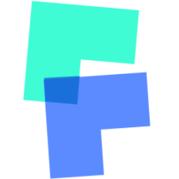

# MegSpot

<p align="center">
  
</p>

English | [中文](README.md)

**MegSpot** is an efficient, professional, cross-platform image & video comparison application.

## Feature

- Support superimposed comparison, drag-and-drop comparison, and GIF result presentation.
- Support pixel-level image viewing, image histogram, RGBA viewing.
- Support to adjust the brightness, contrast, saturation, gray level and other indicators for preview.
- Support video comparison, and inherit all image comparison functions.
- Mac, Linux, Window cross-platform support & automatic update support.
- Support terminal command.
- Support multiple languages: Chinese, English, Japanese.

---

## Download&&install

## introduction

### image compare

### video compare

### drag compare

### Convenient file selection

### terminal command

#### Support incoming folder or file address, support relative and absolute path

- `-h / --help`: view help
- `-i /--image`: enter image compare (default compare) 
- `-v/ --video`: enter video compare
- `-c/ --clear`: Whether clear the selected files or not (default not to clear)

#### Example

- `MegSpot` enter main page
- `MegSpot -i` enter image compare
- `MegSpot -v` enter video compare
- `MegSpot path `Enter the image compare and selection file page (use the current path)
- `MegSpot path -v` Enter the image compare and selection file page (use the current path)
- `MegSpot filePath1 filePath2 filePath3 ... `Add picture/video comparison -v Compare video -c Clear the selected files before -v -c or -vc -cv

---
## source development

```bash
# install dependencies
npm install or yarn install

# start
npm run dev

# build all platform product
npm run build:all

# build contain platform product

npm run build:mac

npm run build:win64

npm run build:win32

```

---
## contribution

- MegSpot according [Contributor Covenant](https://contributor-covenant.org)to manage the open source community。Please read [CODE_OF_CONDUCT](CODE_OF_CONDUCT.md) for details。
- Every contributor needs to sign a contributor license agreement（Contributor License Agreement，CLA）to clarify the intellectual property license related to the content of the contribution,for details[CONTRIBUTOR_LICENSE_AGREEMENT](CONTRIBUTOR_LICENSE_AGREEMENT.md)。
- We welcome you to help MegSpot become better in the following ways：
  - Contribute code;
  - Complete[Documents](https://github.com/MegSpot/Docs)；
  - Report in use [Bugs && Issues](https://github.com/MegEngine/MegSpot/issues)；
  - Review in use [Pull Requests](https://github.com/MegEngine/MegSpot/pulls)；
  - Light up a star for MegSpot
  - Recommend MegSpot to your friends
  - ...

---
## Contact us

- Questions: [github.com/MegEngine/MegSpot/issues](https://github.com/MegEngine/MegSpot/issues)
- Email: [megengine-support@megvii.com](mailto:megengine-support@megvii.com)
- QQ: 782365536

---
## LICENSE

MegSpot use Apache License, Version 2.0

Copyright (c) 2014-2021 Megvii Inc. All rights reserved.
